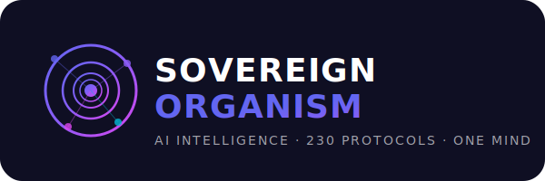

<div align="center">



<br/><br/>

<!-- Badges -->
[](https://github.com/FreddyCreates/AIFX---emergent-already-needs-control-/actions/workflows/ci.yml)
[](https://github.com/FreddyCreates/AIFX---emergent-already-needs-control-/actions/workflows/organism-governance-bot.yml)
[](https://github.com/FreddyCreates/AIFX---emergent-already-needs-control-/actions/workflows/deploy-pages.yml)


[](RIGHTS.md)
[](CITATION.cff)

<br/>

**One intelligence. 230 protocols. 42 browser extensions. 8 SDKs. Zero complexity for you.**

[Get Started](#-get-started) · [What It Does](#-what-it-does) · [Install](#-install) · [Use It](#-use-it) · [For Developers](#-for-developers) · [Research](#-research)

</div>

---

## 🧬 What Is This?

**Sovereign Organism** is a complete AI intelligence system — not just one tool, but an entire living ecosystem of AI extensions, protocols, and services that work together as one mind.

Think of it like this: instead of using 10 different AI apps that don't talk to each other, you get **one unified AI** that does everything — browses with you, writes with you, codes with you, thinks with you, and remembers everything across all your devices.

### Who Is This For?

| You Are... | What You Get |
|:-----------|:-------------|
| 🙋 **A regular user** | Browser extensions that add AI superpowers to every website you visit |
| 💼 **A professional** | Desktop app with 30+ AI tools for writing, research, analysis, and automation |
| 🎨 **A creator** | Creative AI tools for video, voice, visual intelligence, and pattern generation |
| 🔐 **Privacy-focused** | Sovereign architecture — your data stays yours, always |
| 👩‍💻 **A developer** | 8 SDKs, 230 protocols, CLI tools, and full API access |

---

## ⚡ What It Does

<table>
<tr>
<td width="50%">

### 🧩 Browser Extensions (42)
AI-powered extensions that install in seconds:
- **Jarvis** — Full AI assistant in your browser
- **Screen Commander** — AI that sees your screen
- **Knowledge Cartographer** — Auto-organizes your research
- **Voice Forge** — Speak to your AI naturally
- **Sentinel Watch** — Security & privacy guardian
- **Pattern Forge** — Find patterns in any data
- …and 36 more

</td>
<td width="50%">

### 🖥️ Desktop App (Vigil AI)
One-click desktop install:
- All extensions pre-loaded
- Works offline (sovereign cognition)
- Windows, macOS, Linux
- No browser required
- Auto-updates

</td>
</tr>
<tr>
<td>

### 🤖 AI Bots (21 Fleet)
Self-governing bot fleet:
- **Governance Bot** — Keeps the system aligned
- **Intel Bot** — Real-time intelligence gathering
- **Cyber Bot** — Active threat defense
- **Learning Bot** — Continuous self-improvement
- **Cloud Bot** — Distributed edge compute

</td>
<td>

### 🔮 Intelligence Protocols (230)
The nervous system:
- Phi-resonant cognition (Golden Ratio math)
- Hebbian learning (gets smarter over time)
- Memory consolidation (never forgets)
- Sovereign security (unhackable by design)
- Mycelium mesh networking

</td>
</tr>
</table>

---

## 🚀 Get Started

### Choose Your Path

<details>
<summary><strong>🟢 Easiest — One-Click Install (Browser Extensions)</strong></summary>

No coding. No terminal. Just install and go.

**On Mac/Linux:**
```bash
curl -sSL https://raw.githubusercontent.com/FreddyCreates/AIFX---emergent-already-needs-control-/main/install.sh | bash
```

**On Windows (PowerShell):**
```powershell
irm https://raw.githubusercontent.com/FreddyCreates/AIFX---emergent-already-needs-control-/main/install-extensions.ps1 | iex
```

This downloads the extension packs and launches your browser with everything ready.

</details>

<details>
<summary><strong>🟡 Desktop App — Vigil AI (Full Power, Offline-Capable)</strong></summary>

1. Download the installer for your platform from [Releases](https://github.com/FreddyCreates/AIFX---emergent-already-needs-control-/releases)
2. Run the installer
3. Open Vigil AI
4. Done — all 42 extensions + 30 tools are ready

**Or build from source:**
```bash
git clone https://github.com/FreddyCreates/AIFX---emergent-already-needs-control-.git
cd AIFX---emergent-already-needs-control-
npm install
npm run build:desktop
```

</details>

<details>
<summary><strong>🔵 Developer — Full SDK & CLI Access</strong></summary>

```bash
git clone https://github.com/FreddyCreates/AIFX---emergent-already-needs-control-.git
cd AIFX---emergent-already-needs-control-
npm install
npm test          # Run 3,897 tests
npm run lint      # Validate all manifests
npm run status    # See organism health
```

See the [Developer Guide](#-for-developers) below.

</details>

---

## 📦 Install

### System Requirements

| Requirement | Minimum |
|:-----------|:--------|
| **OS** | Windows 10+, macOS 12+, Ubuntu 20.04+ |
| **Browser** | Chrome, Edge, Brave, or any Chromium-based |
| **Disk** | ~200 MB |
| **Internet** | Required for initial install; works offline after |

### Manual Install (No Command Line)

1. Download the [latest release ZIP](https://github.com/FreddyCreates/AIFX---emergent-already-needs-control-/releases)
2. Extract the ZIP anywhere on your computer
3. Open Chrome → go to `chrome://extensions`
4. Toggle **Developer mode** (top right)
5. Click **Load unpacked** → select any extension folder
6. Repeat for each extension you want

---

## 🎯 Use It

Once installed, here's what you can do:

### Daily Usage Examples

| Task | How |
|:-----|:----|
| **Ask AI anything** | Click the Jarvis icon in your browser toolbar |
| **Summarize a webpage** | Right-click → "Sovereign: Summarize this page" |
| **Research a topic** | Open Knowledge Cartographer → paste any URL |
| **Dictate text** | Click Voice Forge → start speaking |
| **Analyze data** | Drag a CSV into Data Alchemist |
| **Check security** | Sentinel Watch runs automatically in the background |
| **Code with AI** | Code Sovereign extension works in any code editor online |

### Desktop App (Vigil AI)

The desktop app gives you everything above **plus**:
- Offline mode — AI works without internet
- File system access — analyze local documents
- System tray — always ready, one click away
- Auto-sync — memory syncs across devices

---

## 👩‍💻 For Developers

### Architecture Overview

```
sovereign-organism/
├── extensions/       # 42 browser extensions (Chrome/Edge/Brave)
├── sdk/              # 8 SDKs (TypeScript, Python, Java, C++, Motoko, Workers)
├── protocols/        # 230 intelligence protocols
├── organism/         # Multi-language organism runtime
├── governance/       # Self-governance laws & pipelines
├── scripts/          # Build, deploy, and CI automation
├── test/             # 3,897 tests across all modules
├── desktop/          # Electron-based Vigil AI desktop app
├── docs/             # Architecture docs & reports
└── research/         # Published papers & preprints
```

### SDK Modules

| SDK | Purpose |
|:----|:--------|
| `intelligence-routing-sdk` | Route AI calls across models optimally |
| `sovereign-memory-sdk` | Persistent sovereign memory layer |
| `organism-runtime-sdk` | Core organism execution runtime |
| `organism-marketplace` | Extension & tool marketplace |
| `windows-desktop-sdk` | Native Windows integration |
| `windows-runtime-sdk` | Windows runtime bindings |
| `cloud-glade` | Phantom security biome |
| `enterprise-integration-sdk` | Enterprise connectors |

### CLI

```bash
# Validate the entire organism
npm run validate

# List all registered components
npm run list

# Check organism health status
npm run status

# Install extensions to browser
npm run install-extensions

# Run full test suite
npm test

# Lint all manifests
npm run lint

# Bundle a release
npm run bundle
```

### Testing

The project maintains **3,897 tests** across all modules:

```bash
npm test                # All tests
npm run test:sdk        # SDK tests only
npm run test:extensions # Extension tests only
npm run test:cli        # CLI tests only
```

### CI/CD

All pushes and PRs run through automated CI:
- ✅ Manifest validation
- ✅ Full test suite (Node 18, 20, 22)
- ✅ Extension build & packaging
- ✅ Governance compliance checks
- ✅ Security scanning

---

## 📚 Research

This project is backed by published research:

| Paper | Topic |
|:------|:------|
| *De Superficie Terminorum* | Native Workstation Surface for Governed Agentic Execution |
| *Ratio Ordinis* | Risk-Aware AI Routing Algorithm for Paradigm-Aware Agentic Execution |
| *Machina Polyglotta Ordinata* | Multi-Terminal AI Orchestration for Cost-Aware Polyglot Computing |

Research artifacts are published to **Zenodo** (DOI-indexed) and **OSF**.

📖 [Theory Paper](docs/sovereign-thinking-theory-paper.md) · 📐 [Architecture Spec](docs/centerfold-engine-spec.md) · 🔬 [Research Mission](research/research-mission.html)

---

## 🏗️ Project Governance

The Sovereign Organism governs itself through:

- **230 protocols** — Codified laws of behavior
- **5 tiers** — From physics (Tier I) to sovereignty (Tier V)
- **21 bots** — Automated governance fleet
- **Hebbian learning** — Continuously self-improving
- **Phi-resonant math** — Grounded in universal constants (φ = 1.618...)

See [`governance/`](governance/) for the full governance framework.

---

## 📋 Repository Structure

<details>
<summary>Click to expand full structure</summary>

| Directory | Contents |
|:----------|:---------|
| `extensions/` | 42 browser extensions, each self-contained |
| `sdk/` | 8 SDKs spanning 6 languages |
| `protocols/` | 230 intelligence & governance protocols |
| `organism/` | Runtime in TypeScript, Python, C++, Java, Motoko, Workers |
| `governance/` | Laws, pipelines, feedback, reports |
| `scripts/` | Build, deploy, governance, CI automation |
| `test/` | 3,897 tests (unit, integration, protocol, CLI) |
| `desktop/` | Electron desktop app (Vigil AI) |
| `docs/` | Architecture docs, reports, dashboards |
| `research/` | Papers, preprints, arXiv materials |
| `papers/` | Published PDFs and metadata |
| `specs/` | System specifications |
| `schemas/` | JSON schemas for validation |
| `zenodo/` | DOI and release records |
| `osf/` | OSF release records |
| `licenses/` | License registry |
| `releases/` | Release packaging |
| `workflows/` | Custom workflow definitions |

</details>

---

## 📜 Citation

If you reference this work in research:

```bibtex
@software{medina2026sovereign,
  author       = {Medina Hernandez, Alfredo},
  title        = {Sovereign Organism: AI Intelligence System},
  year         = {2026},
  publisher    = {GitHub / Zenodo},
  url          = {https://github.com/FreddyCreates/AIFX---emergent-already-needs-control-}
}
```

See [`CITATION.cff`](CITATION.cff) for the machine-readable citation file.

---

## ⚖️ Rights & License

Copyright © Alfredo Medina Hernandez. All rights reserved.

This repository is publicly visible for **reading, citation, and research visibility**. Public access does not imply open-source licensing. See [`RIGHTS.md`](RIGHTS.md) for full terms.

---

<div align="center">

**Built with φ = 1.618033988749895**

<sub>230 protocols · 42 extensions · 8 SDKs · 21 bots · 30 tools · 3,897 tests · One Sovereign Intelligence</sub>

<br/>


</div>
